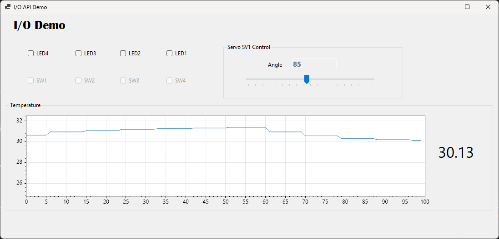

# ServoTempAndIO

A C# **Windows Forms** example (.NET 10) for the course **PB1151 – Objektorientert programmering og databaser** at the **University of South-Eastern Norway (USN)**.

The app controls four LEDs and one servo, reads four switches, and plots a live temperature curve from a TMP102 sensor on a microcontroller connected over a serial port or Bluetooth Low Energy (BLE). It shows how to *use* an I/O library class (`JsonSerialController`) from a GUI — sending LED, servo, and sensor commands and reacting to switch and sensor events — without worrying about how the serial/JSON plumbing, or the transport underneath it, works internally.





## NuGet packages

The project pulls everything it needs from NuGet — there is no project reference to build first:

| Package | Version | Why it is used |
|---|---|---|
| [`Usn.Pb1151.DeviceKit`](https://www.nuget.org/packages/Usn.Pb1151.DeviceKit) | 1.1.2 | The I/O library: `JsonSerialController`, `SerialPortEx`, `BleNusEx`, and the LED/servo/switch/sensor model types. |
| [`ScottPlot.WinForms`](https://www.nuget.org/packages/ScottPlot.WinForms) | 5.1.59 | The `FormsPlot` control and `DataStreamer` used to plot the live temperature curve. |

Restore happens automatically on build, but you can add them to a fresh project with:

```bash
dotnet add package Usn.Pb1151.DeviceKit --version 1.1.2
dotnet add package ScottPlot.WinForms --version 5.1.59
```

In Visual Studio: **Tools → NuGet Package Manager → Manage NuGet Packages for Solution**, then search for the package names above.

### What they bring with them

You never reference these directly, but they are restored as transitive dependencies:

- **`Usn.Pb1151.DeviceKit`** → `System.IO.Ports` (the `SerialPort` implementation behind `SerialPortEx`). The BLE transport uses the Windows Runtime Bluetooth APIs, which is why the project targets `net10.0-windows10.0.19041.0`.
- **`ScottPlot.WinForms`** → `ScottPlot` (the plotting engine) → `SkiaSharp` (the 2D renderer that draws the plot).

The declaration in [`ServoTempAndIO.csproj`](ServoTempAndIO.csproj) is just:

```xml
<ItemGroup>
  <PackageReference Include="ScottPlot.WinForms" Version="5.1.59" />
  <PackageReference Include="Usn.Pb1151.DeviceKit" Version="1.1.2" />
</ItemGroup>
```

> The device library is documented separately — see the [`Usn.Pb1151.DeviceKit` package page](https://www.nuget.org/packages/Usn.Pb1151.DeviceKit) and the [`JsonSerialController` API reference](https://github.com/rlangoy/PB1151vSnippets/blob/main/SerialLedBtnLibEx/Usn.Pb1151.DeviceKit/JsonSerialController.md). The matching MicroPython firmware lives in [`Firmware/Micropython/jsonSerialAndBLE/`](../../Firmware/Micropython/jsonSerialAndBLE).

## Connecting to the device

In `Form1_Load` the serial port is opened and handed to the controller. After that, you only ever talk to the controller — never the raw port:

```csharp
// Initialize the JsonSerialController using a serial port
SerialPortEx _serialDev = new SerialPortEx { PortName = "COM3", BaudRate = 115200 };
_serialDev.Open();
jsonSerialController = new JsonSerialController(_serialDev);

// Listen for switch events from the device
jsonSerialController.ButtonControl["SW1"].ValueChanged += Form1_SwitchStateChanged;

// Turn LED1 on
jsonSerialController.LedControl["LED1"].Value = 1;

// Move the servo to 90 degrees
jsonSerialController.ServoControl["SV1"].Angle = 90;
```

What each line does:

- **`new SerialPortEx { PortName = "COM3", BaudRate = 115200 }`** — opens COM3 at 115200 baud. Change `COM3` to match the port your board uses.
- **`new JsonSerialController(_serialDev)`** — wraps the port. The controller exposes four helpers: `LedControl` and `ServoControl` (outgoing), `ButtonControl` (incoming), and `SensorControl` (request/response).
- **`ButtonControl["SW1"].ValueChanged += ...`** — subscribes to a single switch by name. When `SW1` changes on the hardware, your handler runs. Do the same for `SW2`, `SW3`, and `SW4`.
- **`LedControl["LED1"].Value = 1`** — turns `LED1` on (`0` = off, `1` = on). See [Controlling an LED](#controlling-an-led-pc--device) below.
- **`ServoControl["SV1"].Angle = 90`** — moves servo `SV1` to 90°. See [Controlling a servo](#controlling-a-servo-pc--device) below.

The form also parks the servo at a known angle on startup, so the trackbar and the hardware agree from the first frame:

```csharp
jsonSerialController.ServoControl.SetAll(trackBar1.Value);  // all servos to the same angle (0°)
```

### Connecting over BLE instead

`BleNusEx` implements the same `ISerialDataReadWrite` interface as `SerialPortEx`, so it is a drop-in replacement — `JsonSerialController` cannot tell the difference:

```csharp
BleNusEx _serialDev = new BleNusEx("Pico-NUS");
await _serialDev.ConnectAsync(TimeSpan.FromSeconds(15));
jsonSerialController = new JsonSerialController(_serialDev);
```

- **`new BleNusEx("Pico-NUS")`** — the constructor takes the name your board advertises over BLE. Change `"Pico-NUS"` to match your board.
- **`ConnectAsync(TimeSpan.FromSeconds(15))`** — scans for the device, connects, and subscribes to notifications on the Nordic UART Service (NUS). Throws `BleConnectionException` if Bluetooth is off or the device isn't found within the timeout.
- Everything downstream — `LedControl`, `ServoControl`, `ButtonControl`, `SensorControl` — is unchanged, since both transports satisfy `ISerialDataReadWrite`.

`Form1.cs` has both connection methods; only one is active — comment out the one you are not using.

## Reacting to a switch (device → PC)

The handler receives a `SwitchEventArgs` with which switch changed (`Id`) and its new value:

```csharp
private void Form1_SwitchStateChanged(object? sender, SwitchEventArgs e)
{
    if (e.Id == "SW1")
        checkBox2.BeginInvoke(() => checkBox2.Checked = Convert.ToBoolean(e.Value));
}
```

> **Why `BeginInvoke`?** The serial data arrives on a background thread, but Windows Forms controls may only be touched from the GUI thread. `BeginInvoke` marshals the update back onto the UI thread. Updating the checkbox directly from the event would throw a cross-thread exception.

## Controlling an LED (PC → device)

Writing to an LED is a single assignment. The controller serializes it to JSON and sends it over the port for you:

```csharp
private void checkBox1_CheckedChanged(object sender, EventArgs e)
{
    // checkBox1.Checked returns a bool, so convert it to an int (0 or 1)
    jsonSerialController.LedControl["LED1"].Value = Convert.ToInt32(checkBox1.Checked);
}
```

- **`LedControl["LED1"]`** — look up an LED by name.
- **`.Value = ...`** — set it. `0` = off, `1` = on. Setting the value automatically sends the command; nothing happens if the value is unchanged.
- **`Convert.ToInt32(bool)`** — a checkbox gives `true`/`false`; the LED wants `0`/`1`.

## Controlling a servo (PC → device)

The trackbar drives the servo the same way a checkbox drives an LED:

```csharp
private void trackBar1_Scroll(object sender, EventArgs e)
{
    jsonSerialController.ServoControl["SV1"].Angle = trackBar1.Value;
    this.textBox1.Text = trackBar1.Value.ToString();
}
```

- **`ServoControl["SV1"]`** — look up the servo by name.
- **`.Angle = ...`** — set the target angle in degrees. The value is clamped to `0`–`180`; setting the angle it already has sends nothing.
- **`textBox1.Text = ...`** — just mirrors the trackbar value in the textbox; no serial traffic involved.

> To let a servo go slack when it's not needed (less jitter and heat), call `jsonSerialController.ServoControl.Release("SV1")` instead of setting an angle.

## Reading a sensor (PC → device → PC)

Sensors work in two steps: subscribe to the reading event, then ask the device to send data — either once or as a continuous stream:

```csharp
// Listen for temperature readings
jsonSerialController.SensorControl["TEMP1"].DataChanged += Form1_TempSensorDataChanged;

// Stream the temperature every 25 ms (fastest recommended interval)
jsonSerialController.SensorControl.StartStream("TEMP1", 25);

// Or ask for a single reading instead
jsonSerialController.SensorControl.Read("TEMP1");

// Stop a running stream
jsonSerialController.SensorControl.StopStream("TEMP1");
```

The handler receives a `SensorEventArgs`; pattern-match the sensor to its concrete type to get at the values:

```csharp
private void Form1_TempSensorDataChanged(object? sender, SensorEventArgs e)
{
    if (sender is TempSensor sensor)
        BeginInvoke(() => UpdateTemp(sensor.Value));
}
```

- **`SensorControl["TEMP1"]`** — look up a sensor by name (`"TEMP1"` = TMP102 temperature, `"ACC1"` = ADXL345 acceleration).
- **`.DataChanged += ...`** — runs your handler for *every* reading, whether it came from a one-shot `Read` or a stream tick. `TempSensor` exposes `Value` (°C) and `Unit`; `AccSensor` exposes `X`, `Y`, `Z` (g).
- **`StartStream("TEMP1", 25)` / `StopStream("TEMP1")`** — the device sends readings on its own every 25 ms until told to stop.
- **`BeginInvoke`** — same rule as switches: readings arrive on a background thread, so GUI updates must be marshalled to the UI thread.

> If the hardware fails (e.g. an I²C sensor doesn't answer), the device reports an error code such as `i2c_nack`. Subscribe to `jsonSerialController.SensorControl.SensorError` to catch these instead of silently getting no reading.

## Plotting the temperature with ScottPlot

The chart is a `FormsPlot` control from `ScottPlot.WinForms`. A `DataStreamer` holds a fixed-size rolling buffer — you push values in, and it handles the scrolling for you:

```csharp
ScottPlot.Plottables.DataStreamer logger = null!;

private async void Form1_Load(object sender, EventArgs e)
{
    logger = formsPlot1.Plot.Add.DataStreamer(100);   // keep the last 100 samples
    // ...
}

public void UpdateTemp(double tempValue)
{
    logger.Add(tempValue);          // push one sample into the rolling buffer
    logger.ViewScrollLeft();        // scroll so the newest sample is on the right
    formsPlot1.Refresh();           // redraw the control
    label4.Text = $"{tempValue}";   // show the value as text too
}
```

- **`formsPlot1.Plot.Add.DataStreamer(100)`** — creates the streaming plot with room for 100 samples; older values fall off the end.
- **`logger.Add(...)`** — append one reading. Called from `UpdateTemp`, which already runs on the UI thread thanks to `BeginInvoke`.
- **`formsPlot1.Refresh()`** — ScottPlot does not redraw on its own; call this after adding data.

## Running it

Requirements: **.NET 10 SDK** on **Windows 10 (build 19041) or newer**.

```bash
dotnet run
```

Or open [`ServoTempAndIO.slnx`](ServoTempAndIO.slnx) in Visual Studio and press **F5**.

> Set the COM port in `Form1.cs` to match your board, and close any serial console (e.g. Thonny) first — only one program can hold the port at a time. If you're connecting over BLE instead, no COM port is needed — just make sure Bluetooth is turned on and the board is advertising.

## License

MIT — see [`LICENSE`](../../LICENSE) in the repository root.
