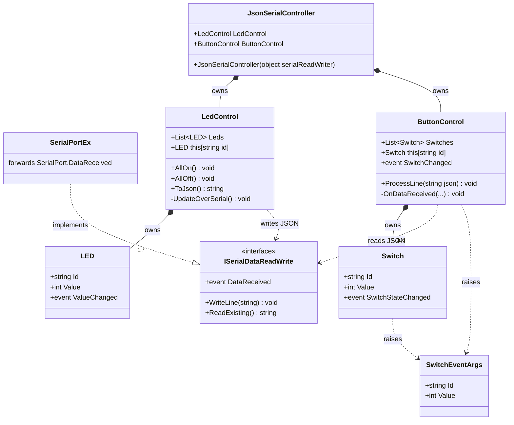
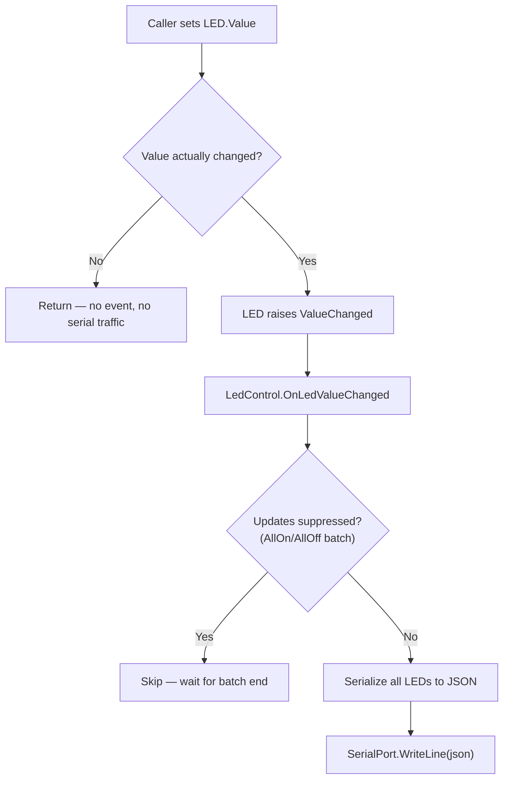
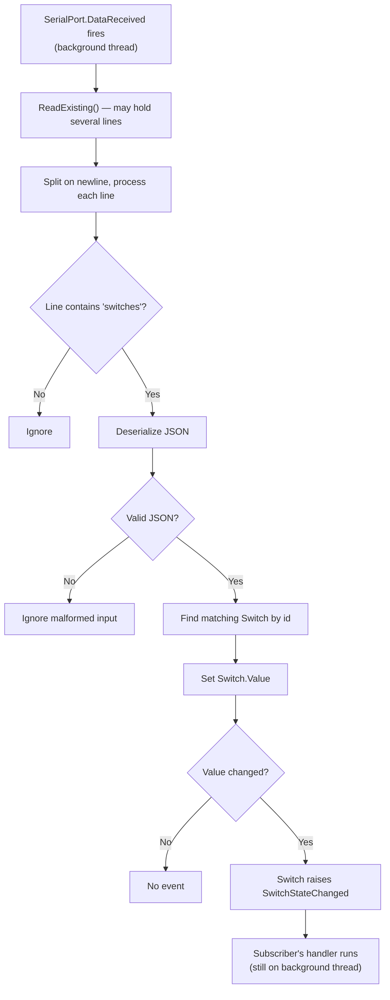

# JsonSerialController — Class Documentation

I/O library for the **SerialLedBtnLibEx** example (PB1151, USN).

`JsonSerialController` is a small object-oriented wrapper around a serial port (abstracted behind `ISerialDataReadWrite`). It exposes the device as two halves:

- **`LedControl`** — *outgoing*: set an LED value and it is serialized to JSON and written to the port.
- **`ButtonControl`** — *incoming*: parses JSON arriving from the device and raises C# events when a switch changes.

The caller never touches JSON or the raw port directly — only objects, properties, and events.

## Class diagram



## Responsibilities

| Class | Responsibility |
|-------|----------------|
| `JsonSerialController` | Composition root. Takes an `object`, verifies it implements `ISerialDataReadWrite` (else throws `ArgumentException`), then constructs and owns `LedControl` and `ButtonControl`, sharing the one port. |
| `ISerialDataReadWrite` | Abstraction the controls depend on: `WriteLine`, `ReadExisting`, and a `DataReceived` event. Decouples the library from `System.IO.Ports.SerialPort`. |
| `SerialPortEx` | A `SerialPort` subclass that implements `ISerialDataReadWrite`, forwarding the native `DataReceived` event. Pass one of these to `JsonSerialController` (a plain `SerialPort` does not implement the interface). |
| `LedControl` | Owns the four `LED` objects. Serializes their state to JSON and writes it whenever one changes. Provides `AllOn`/`AllOff`. |
| `LED` | One LED. Holds an `Id` and a `Value`; raises `ValueChanged` only when the value actually changes. |
| `ButtonControl` | Owns the three `Switch` objects. Listens to `ISerialDataReadWrite.DataReceived`, parses incoming JSON, and updates the matching switch. |
| `Switch` | One pushbutton. Holds an `Id` and `Value`; raises `SwitchStateChanged` (carrying a `SwitchEventArgs`) only when the value changes. |
| `SwitchEventArgs` | Event payload: which switch (`Id`) and its new `Value`. |

## JSON protocol

Line-based: one JSON object per line.

**PC → device (LEDs out):**

```json
{"leds":[{"id":"LED1","value":1},{"id":"LED2","value":0}, ...]}
```

**Device → PC (switch changed):**

```json
{"switches":[{"id":"SW1","value":1}]}
```

## Activity — outgoing (setting an LED)

What happens when a caller writes `LedControl["LED1"].Value = 1;`



The "value actually changed?" guard means setting an LED to the value it already has produces **no** serial traffic. `AllOn()`/`AllOff()` set every LED with updates suppressed, then send **one** combined message instead of four.

## Activity — incoming (a switch press)

What happens when the device sends `{"switches":[{"id":"SW1","value":1}]}`



> **Thread note:** `DataReceived` runs on a background thread, so any handler that updates Windows Forms controls must marshal to the UI thread with `BeginInvoke`. See `Form1.cs`.

## Implementation notes

- **Event only on real change.** Both `LED` and `Switch` compare new vs. old value in their `Value` setter and return early if equal. This avoids redundant events and serial writes, and prevents feedback loops.
- **No event during construction.** Constructors assign the backing field (`_value`) directly, not the property, so `ValueChanged`/`SwitchStateChanged` do not fire while objects are being built.
- **Indexer lookup by id.** `LedControl["LED1"]` and `ButtonControl["SW1"]` use an indexer that searches by `Id` and throws `KeyNotFoundException` for an unknown id — readable call sites without exposing the list.
- **Batch updates.** `LedControl` sets a `_suppressUpdates` flag around `AllOn`/`AllOff` so the many `ValueChanged` events collapse into a single serial write (in a `try/finally` so the flag always resets).
- **Robust parsin