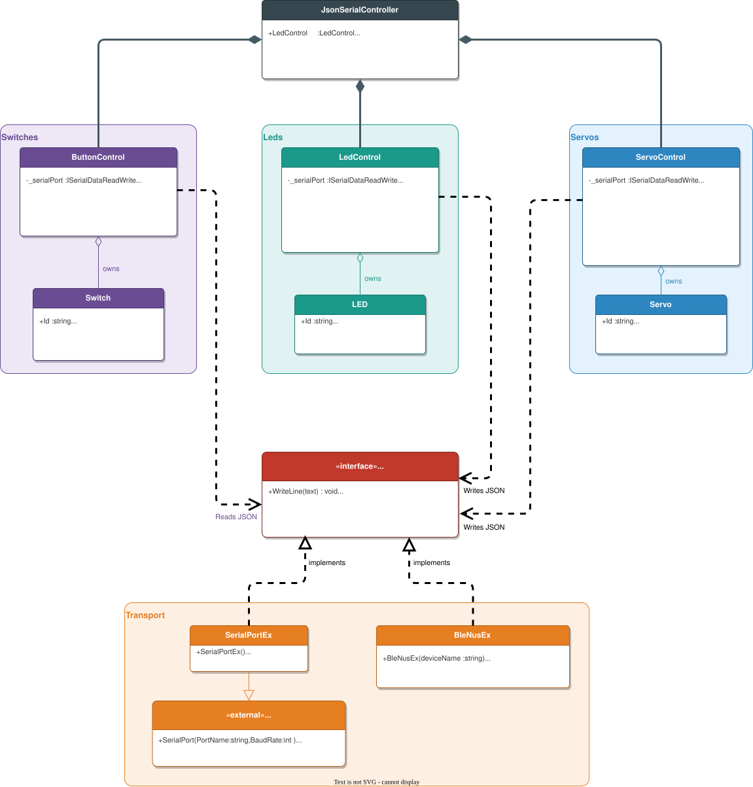
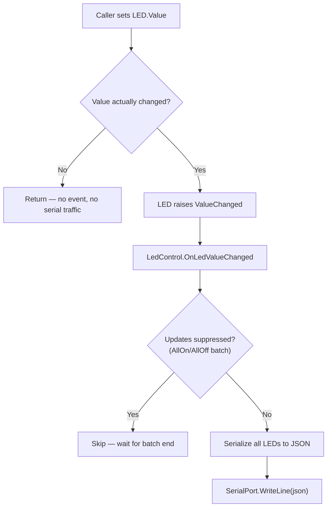
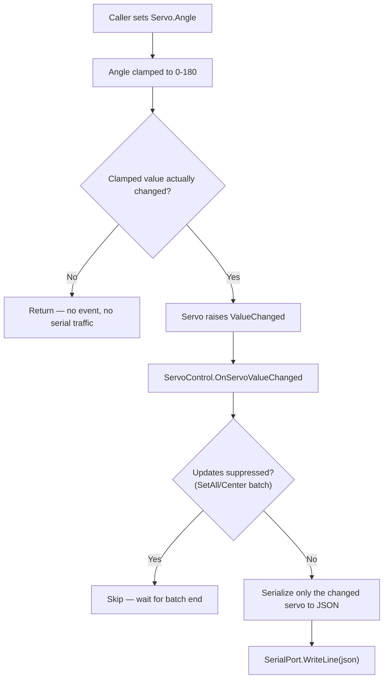
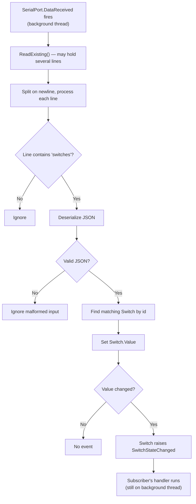

# JsonSerialController — Class Documentation

I/O library for the **SerialLedBtnLibEx** example (PB1151, USN).

`JsonSerialController` is a small object-oriented wrapper around a serial port (abstracted behind `ISerialDataReadWrite`, implemented by either `SerialPortEx` for USB serial or `BleNusEx` for BLE). It exposes the device as three parts:

- **`LedControl`** — *outgoing*: set an LED value and it is serialized to JSON and written to the port.
- **`ServoControl`** — *outgoing*: set a servo's angle (or release it) and it is serialized to JSON and written to the port.
- **`ButtonControl`** — *incoming*: parses JSON arriving from the device and raises C# events when a switch changes.

The caller never touches JSON or the raw port directly — only objects, properties, and events.

## Class diagram



## Responsibilities

| Class | Responsibility |
|-------|----------------|
| `JsonSerialController` | Composition root. Takes an `ISerialDataReadWrite`, then constructs and owns `LedControl`, `ServoControl`, and `ButtonControl`, sharing the one port. |
| `ISerialDataReadWrite` | Abstraction the controls depend on: `WriteLine`, `ReadExisting`, and a `DataReceived` event. Decouples the library from any one transport. |
| `SerialPortEx` | A `SerialPort` subclass that implements `ISerialDataReadWrite`, forwarding the native `DataReceived` event. Pass one of these to `JsonSerialController` (a plain `SerialPort` does not implement the interface). |
| `BleNusEx` | A BLE alternative to `SerialPortEx`. Scans for and connects to a peripheral exposing the Nordic UART Service (NUS), and implements `ISerialDataReadWrite` over it, so `JsonSerialController` can use it exactly like a serial port. |
| `LedControl` | Owns the four `LED` objects. Serializes their state to JSON and writes it whenever one changes. Provides `AllOn`/`AllOff`. |
| `LED` | One LED. Holds an `Id` and a `Value`; raises `ValueChanged` only when the value actually changes. |
| `ServoControl` | Owns the servo object(s) (currently `SV1`). Serializes an angle change to JSON and writes it; sends a `release` action on its own. Provides `Center`/`SetAll`. |
| `Servo` | One servo. Holds an `Id` and an `Angle` (clamped to 0–180); raises `ValueChanged` only when the clamped angle actually changes. |
| `ButtonControl` | Owns the three `Switch` objects. Listens to `ISerialDataReadWrite.DataReceived`, parses incoming JSON, and updates the matching switch. |
| `Switch` | One pushbutton. Holds an `Id` and `Value`; raises `SwitchStateChanged` (carrying a `SwitchEventArgs`) only when the value changes. |


## JSON protocol

Line-based: one JSON object per line.

**PC → device (LEDs out):**

```json
{"leds":[{"id":"LED1","value":1},{"id":"LED2","value":0}, ...]}
```

**PC → device (servo angle out):**

```json
{"servos":[{"id":"SV1","angle":90}]}
```

**PC → device (servo release out):**

```json
{"servos":[{"id":"SV1","action":"release"}]}
```

**Device → PC (switch changed):**

```json
{"switches":[{"id":"SW1","value":1}]}
```

## Activity — outgoing (setting an LED)

What happens when a caller writes `LedControl["LED1"].Value = 1;`



The "value actually changed?" guard means setting an LED to the value it already has produces **no** serial traffic. `AllOn()`/`AllOff()` set every LED with updates suppressed, then send **one** combined message instead of four.

## Activity — outgoing (setting a servo angle)

What happens when a caller writes `ServoControl["SV1"].Angle = 90;`



Unlike `LedControl`, which resends the full LED set on every change, `ServoControl` serializes and sends only the servo that changed — so releasing one servo is not undone by re-sending another servo's last angle. `Center()`/`SetAll()` set every servo with updates suppressed, then send **one** combined message, mirroring `LedControl.AllOn`/`AllOff`.

`Release(id)` bypasses this flow entirely: it sends a one-off `{"action":"release"}` message rather than an angle, since releasing is an action, not a position. The device re-attaches the servo automatically on its next angle command.

## Activity — incoming (a switch press)

What happens when the device sends `{"switches":[{"id":"SW1","value":1}]}`



> **Thread note:** `DataReceived` runs on a background thread, so any handler that updates Windows Forms controls must marshal to the UI thread with `BeginInvoke`. See `Form1.cs`.

## Implementation notes

- **Event only on real change.** `LED`, `Servo`, and `Switch` all compare new vs. old value (clamped, for `Servo`) in their setter and return early if unchanged. This avoids redundant events and serial writes, and prevents feedback loops.
- **No event during construction.** Constructors assign the backing field (`_value`/`_angle`) directly, not the property, so `ValueChanged`/`SwitchStateChanged` do not fire while objects are being built.
- **Indexer lookup by id.** `LedControl["LED1"]`, `ServoControl["SV1"]`, and `ButtonControl["SW1"]` use an indexer that searches by `Id` and throws `KeyNotFoundException` for an unknown id — readable call sites without exposing the list.
- **Batch updates.** `LedControl` and `ServoControl` each set a `_suppressUpdates` flag around their `AllOn`/`AllOff`/`Center`/`SetAll` methods so many `ValueChanged` events collapse into a single serial write (in a `try/finally` so the flag always resets).
- **Per-servo sends.** Outside a batch, `ServoControl` writes only the servo that changed rather than a full snapshot (unlike `LedControl`, which always resends every LED). This keeps `Release` on one servo from being clobbered by another servo's last angle.
- **Robust parsing.** `ButtonControl` only parses lines containing `"switches"`, wraps deserialization in `try/catch (JsonException)`, and ignores malformed or unknown ids rather than throwing.
- **Two events on `ButtonControl`.** Subscribe to a *specific* switch via `ButtonControl["SW1"].SwitchStateChanged`, or to *any* switch via `ButtonControl.SwitchChanged` (inspect `SwitchEventArgs.Id`).
- **Separation of concerns.** Outgoing (LEDs, servos) and incoming (switches) live in separate classes; `JsonSerialController` just composes them over one shared port.
- **Port abstraction, two transports.** The controls depend on `ISerialDataReadWrite`, not on `SerialPort` directly. `SerialPortEx` adapts the framework `SerialPort` to that interface (notably mapping the native `SerialDataReceivedEventHandler` event); `BleNusEx` adapts a BLE Nordic UART Service connection to the same interface instead. This keeps the library testable with a mock port, avoids coupling to `System.IO.Ports`, and lets `JsonSerialController` run unmodified over USB serial or BLE.

## Usage

```csharp
// SerialPortEx implements ISerialDataReadWrite; a plain SerialPort does not.
var port = new SerialPortEx { PortName = "COM3", BaudRate = 9600 };
port.Open();
var controller = new JsonSerialController(port);

// Outgoing: turn LED1 on
controller.LedControl["LED1"].Value = 1;

// Outgoing: move SV1 to 90 degrees, then let it go slack
controller.ServoControl["SV1"].Angle = 90;
controller.ServoControl.Release("SV1");

// Incoming: react to SW1
controller.ButtonControl["SW1"].SwitchStateChanged += (s, e) =>
{
    Console.WriteLine($"{e.Id} = {e.Value}");
};
```

`BleNusEx` implements `ISerialDataReadWrite` too, so it drops in unchanged:

```csharp
var ble = new BleNusEx("Pico-NUS");
await ble.ConnectAsync(TimeSpan.FromSeconds(15));
var controller = new JsonSerialController(ble);
```
