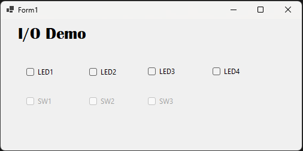

# SerialLedBtnLibEx

A C# **Windows Forms** example (.NET 10) for the course **PB1151 – Objektorientert programmering og databaser** at **USN**.

The app controls four LEDs and reads three pushbuttons on a microcontroller over a serial port. It shows how to *use* an I/O library class (`JsonSerialController`) from a GUI — sending LED commands and reacting to switch events — without worrying about how the serial/JSON plumbing works internally.



Each row pairs an **LED** checkbox (output, PC → device) with a **SW** checkbox (input, device → PC):

- Tick an `LED` box → that LED turns on.
- Press a physical button → its `SW` box updates automatically.

## Connecting to the device

In `Form1_Load` the serial port is opened and handed to the controller. After that, you only ever talk to the controller — never the raw port:

```csharp
_serialPort = new SerialPortEx { PortName = "COM3", BaudRate = 9600 };
_serialPort.Open();
jsonSerialController = new JsonSerialController(_serialPort);
jsonSerialController.ButtonControl["SW1"].SwitchStateChanged += Form1_SwitchStateChanged;
```

What each line does:

- **`new SerialPortEx { PortName = "COM3", BaudRate = 9600 }`** — opens COM3 at 9600 baud. Change `COM3` to match the port your board uses.
- **`new JsonSerialController(_serialPort)`** — wraps the port. The controller exposes two helpers: `LedControl` (outgoing) and `ButtonControl` (incoming).
- **`ButtonControl["SW1"].SwitchStateChanged += ...`** — subscribes to a single switch by name. When `SW1` changes on the hardware, your handler runs. Do the same for `SW2` and `SW3`.

## Reacting to a switch (device → PC)

The handler receives a `SwitchEventArgs` with which switch changed (`Id`) and its new value:

```csharp
private void Form1_SwitchStateChanged(object? sender, SwitchEventArgs e)
{
    if (e.Id == "SW1")
        checkBox2.BeginInvoke(() => checkBox2.Checked = Convert.ToBoolean(e.Value));
}
```

> **Why `BeginInvoke`?** The serial data arrives on a background thread, but Windows Forms controls may only be touched from the GUI thread. `BeginInvoke` marshals the update back onto the UI thread. Updating the checkbox directly from the event would throw a cross-thread exception.

## Controlling an LED (PC → device)

Writing to an LED is a single assignment. The controller serializes it to JSON and sends it over the port for you:

```csharp
private void checkBox1_CheckedChanged(object sender, EventArgs e)
{
    // checkBox1.Checked returns a bool, so convert it to an int (0 or 1)
    jsonSerialController.LedControl["LED1"].Value = Convert.ToInt32(checkBox1.Checked);
}
```

- **`LedControl["LED1"]`** — look up an LED by name.
- **`.Value = ...`** — set it. `0` = off, `1` = on. Setting the value automatically sends the command; nothing happens if the value is unchanged.
- **`Convert.ToInt32(bool)`** — a checkbox gives `true`/`false`; the LED wants `0`/`1`.

## Running it

Requirements: **.NET 10 SDK** on **Windows**.

```bash
dotnet run
```

Or open `SerialLedBtnLibEx.csproj` in Visual Studio and press **F5**.

> Set the COM port in `Form1.cs` to match your board, and close any serial console (e.g. Thonny) first — only one program can hold the port at a time.
