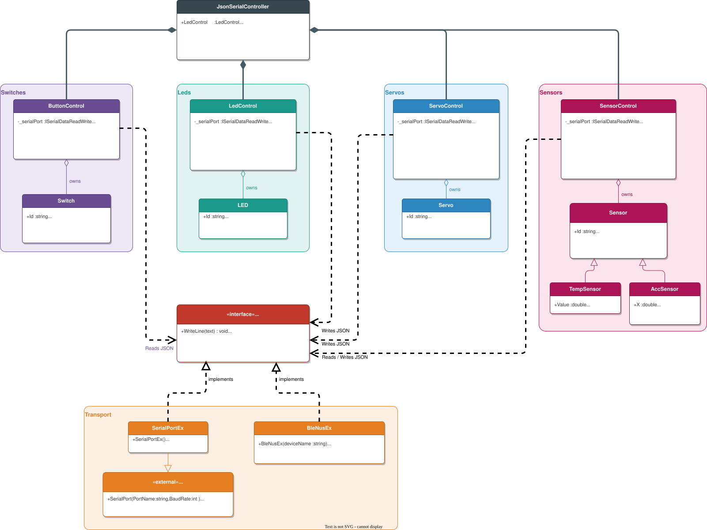
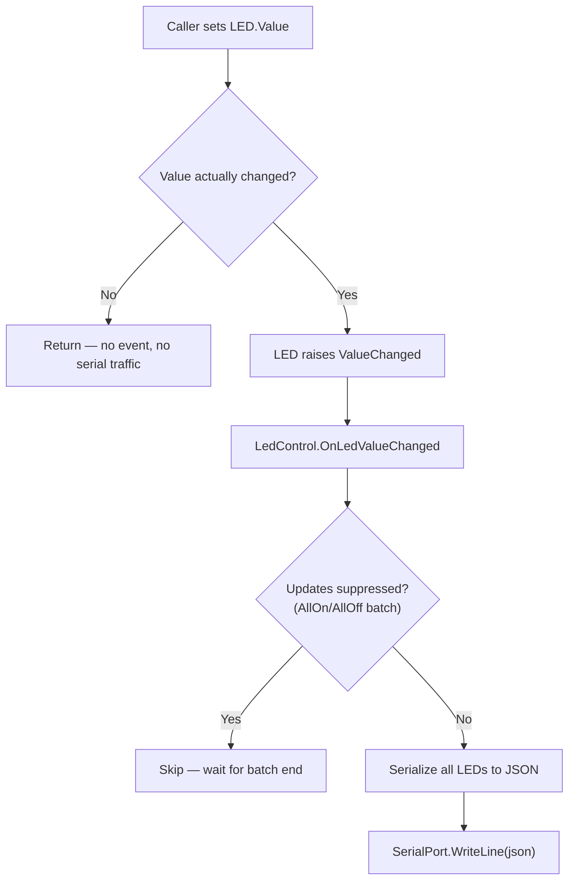
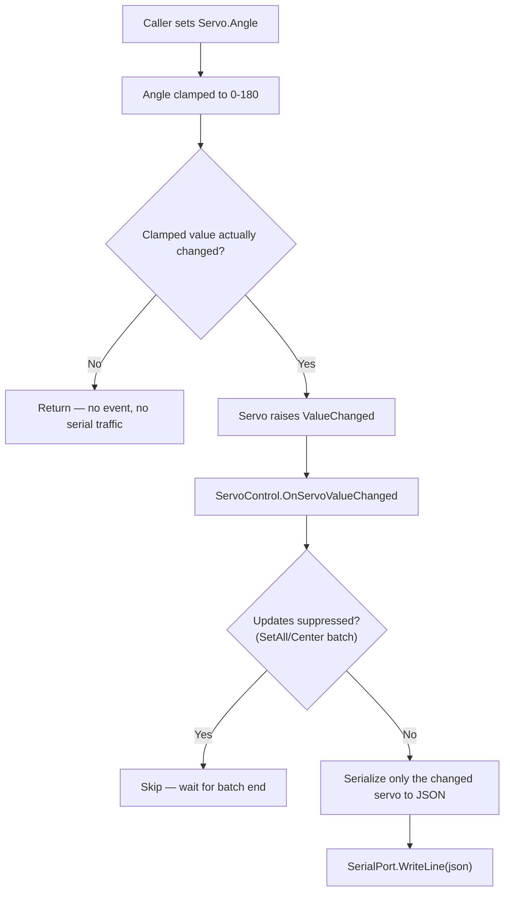
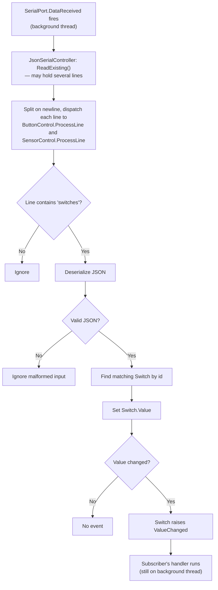
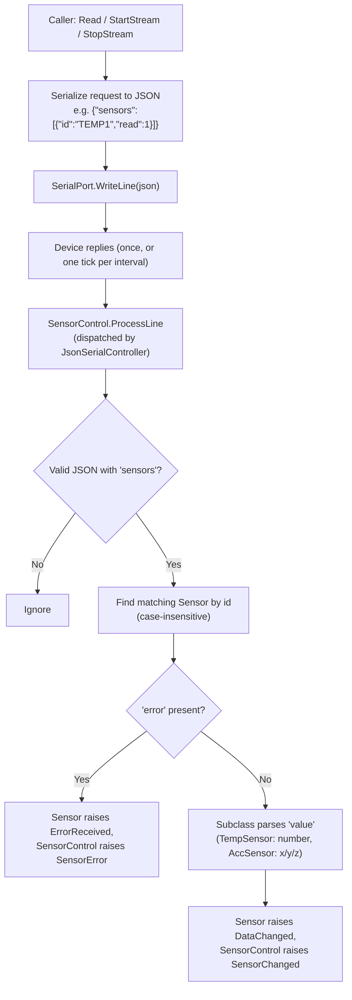

# JsonSerialController — Class Documentation

I/O library for the **Usn.Pb1151.DeviceKit** package (course PB1151, USN).

`JsonSerialController` is a small object-oriented wrapper around a serial port (abstracted behind `ISerialDataReadWrite`, implemented by either `SerialPortEx` for USB serial or `BleNusEx` for BLE). It exposes the device as four parts:

- **`LedControl`** — *outgoing*: set an LED value and it is serialized to JSON and written to the port.
- **`ServoControl`** — *outgoing*: set a servo's angle (or release it) and it is serialized to JSON and written to the port.
- **`ButtonControl`** — *incoming*: parses JSON arriving from the device and raises C# events when a switch changes.
- **`SensorControl`** — *both directions*: sends read/stream/stop requests for the sensors (TMP102 temperature, ADXL345 acceleration), parses the readings coming back, and raises C# events for every reading or error.

The caller never touches JSON or the raw port directly — only objects, properties, and events.

## Class diagram



## Responsibilities

| Class | Responsibility |
|-------|----------------|
| `JsonSerialController` | Composition root. Takes an `ISerialDataReadWrite`, then constructs and owns `LedControl`, `ServoControl`, `ButtonControl`, and `SensorControl`, sharing the one port. Also the single reader of incoming data: it drains the port and hands each line to `ButtonControl.ProcessLine` and `SensorControl.ProcessLine`, so the two parsers never compete for serial data. |
| `ISerialDataReadWrite` | Abstraction the controls depend on: `WriteLine`, `ReadExisting`, and a `DataReceived` event. Decouples the library from any one transport. |
| `SerialPortEx` | A `SerialPort` subclass that implements `ISerialDataReadWrite`, forwarding the native `DataReceived` event. Pass one of these to `JsonSerialController` (a plain `SerialPort` does not implement the interface). |
| `BleNusEx` | A BLE alternative to `SerialPortEx`. Scans for and connects to a peripheral exposing the Nordic UART Service (NUS), and implements `ISerialDataReadWrite` over it, so `JsonSerialController` can use it exactly like a serial port. |
| `LedControl` | Owns the four `LED` objects. Serializes their state to JSON and writes it whenever one changes. Provides `AllOn`/`AllOff`. |
| `LED` | One LED. Holds an `Id` and a `Value`; raises `ValueChanged` only when the value actually changes. |
| `ServoControl` | Owns the servo object(s) (currently `SV1`). Serializes an angle change to JSON and writes it; sends a `release` action on its own. Provides `Center`/`SetAll`. |
| `Servo` | One servo. Holds an `Id` and an `Angle` (clamped to 0–180); raises `ValueChanged` only when the clamped angle actually changes. |
| `ButtonControl` | Owns the three `Switch` objects. Listens to `ISerialDataReadWrite.DataReceived`, parses incoming JSON, and updates the matching switch. |
| `Switch` | One pushbutton. Holds an `Id` and `Value`; raises `ValueChanged` (carrying a `SwitchEventArgs`) only when the value changes. |
| `SensorControl` | Owns the sensor objects (`TEMP1`, `ACC1`). Sends `read`/`stream`/`stop` requests, parses incoming sensor JSON, and routes each reading or error to the matching sensor. |
| `Sensor` | Abstract base for one sensor. Holds an `Id` and `Unit`; raises `DataChanged` (carrying a `SensorEventArgs`) for every reading and `ErrorReceived` when the device reports an error. Subclasses only parse the sensor-specific `value` payload. |
| `TempSensor` | TMP102 temperature sensor (`TEMP1`). Parses a numeric `value` into `Value` (degrees, unit `"C"`). |
| `AccSensor` | ADXL345 acceleration sensor (`ACC1`). Parses a `{x, y, z}` object into `X`, `Y`, `Z` (unit `"g"`). |


## JSON protocol

Line-based: one JSON object per line.

**PC → device (LEDs out):**

```json
{"leds":[{"id":"LED1","value":1},{"id":"LED2","value":0}, ...]}
```

**PC → device (servo angle out):**

```json
{"servos":[{"id":"SV1","angle":90}]}
```

**PC → device (servo release out):**

```json
{"servos":[{"id":"SV1","action":"release"}]}
```

**Device → PC (switch changed):**

```json
{"switches":[{"id":"SW1","value":1}]}
```

**PC → device (read a sensor once):**

```json
{"sensors":[{"id":"TEMP1","read":1}]}
{"sensors":[{"id":"ACC1","read":1}]}
```

**PC → device (start / stop streaming a sensor at its own rate):**

```json
{"sensors":[{"id":"ACC1","action":"stream","interval_ms":50}]}
{"sensors":[{"id":"ACC1","action":"stop"}]}
```

**Device → PC (sensor reading — same shape for one-shot reads and stream ticks):**

```json
{"sensors":[{"id":"TEMP1","value":23.56,"unit":"C"}]}
{"sensors":[{"id":"ACC1","value":{"x":0.012,"y":-0.004,"z":0.998},"unit":"g"}]}
```

**Device → PC (sensor failure, per id):**

```json
{"sensors":[{"id":"TEMP1","error":"i2c_nack"}]}
```

> **Casing note:** the device lowercases incoming lines before parsing, so command and id casing is not significant. `SensorControl` matches ids case-insensitively for the same reason; avoid carrying case-sensitive string values in commands.

## Activity — outgoing (setting an LED)

What happens when a caller writes `LedControl["LED1"].Value = 1;`



The "value actually changed?" guard means setting an LED to the value it already has produces **no** serial traffic. `AllOn()`/`AllOff()` set every LED with updates suppressed, then send **one** combined message instead of four.

## Activity — outgoing (setting a servo angle)

What happens when a caller writes `ServoControl["SV1"].Angle = 90;`



Unlike `LedControl`, which resends the full LED set on every change, `ServoControl` serializes and sends only the servo that changed — so releasing one servo is not undone by re-sending another servo's last angle. `Center()`/`SetAll()` set every servo with updates suppressed, then send **one** combined message, mirroring `LedControl.AllOn`/`AllOff`.

`Release(id)` bypasses this flow entirely: it sends a one-off `{"action":"release"}` message rather than an angle, since releasing is an action, not a position. The device re-attaches the servo automatically on its next angle command.

## Activity — incoming (a switch press)

What happens when the device sends `{"switches":[{"id":"SW1","value":1}]}`



> **Thread note:** `DataReceived` runs on a background thread, so any handler that updates GUI controls (e.g. Windows Forms) must marshal to the UI thread, for example with `BeginInvoke`.

## Activity — sensors (request and reading)

What happens when a caller runs `SensorControl.Read("TEMP1")` (or `StartStream`/`StopStream`) and the device answers:



Unlike a `Switch`, a sensor raises `DataChanged` for **every** reading — stream ticks with an unchanged value still fire the event, since each tick is a new measurement. One-shot reads and stream ticks arrive in the same JSON shape, so the parsing path is identical.

## Implementation notes

- **Event only on real change.** `LED`, `Servo`, and `Switch` all compare new vs. old value (clamped, for `Servo`) in their setter and return early if unchanged. This avoids redundant events and serial writes, and prevents feedback loops.
- **No event during construction.** Constructors assign the backing field (`_value`/`_angle`) directly, not the property, so `ValueChanged`/`ValueChanged` do not fire while objects are being built.
- **Indexer lookup by id.** `LedControl["LED1"]`, `ServoControl["SV1"]`, and `ButtonControl["SW1"]` use an indexer that searches by `Id` and throws `KeyNotFoundException` for an unknown id — readable call sites without exposing the list.
- **Batch updates.** `LedControl` and `ServoControl` each set a `_suppressUpdates` flag around their `AllOn`/`AllOff`/`Center`/`SetAll` methods so many `ValueChanged` events collapse into a single serial write (in a `try/finally` so the flag always resets).
- **Per-servo sends.** Outside a batch, `ServoControl` writes only the servo that changed rather than a full snapshot (unlike `LedControl`, which always resends every LED). This keeps `Release` on one servo from being clobbered by another servo's last angle.
- **Robust parsing.** `ButtonControl` only parses lines containing `"switches"` and `SensorControl` only lines containing `"sensors"`; both wrap deserialization in `try/catch (JsonException)` and ignore malformed or unknown ids rather than throwing.
- **Two events on `ButtonControl`.** Subscribe to a *specific* switch via `ButtonControl["SW1"].ValueChanged`, or to *any* switch via `ButtonControl.SwitchChanged` (inspect `SwitchEventArgs.Id`).
- **Same two-level events on `SensorControl`.** Subscribe to a *specific* sensor via `SensorControl["TEMP1"].DataChanged`, or to *any* sensor via `SensorControl.SensorChanged`; errors mirror this with `ErrorReceived` per sensor and `SensorError` on the control.
- **Inheritance for sensor types.** `Sensor` is an abstract base holding the shared `Id`/`Unit`/events; `TempSensor` and `AccSensor` override only `TryParseValue`, so the `value` payload can be a number for one sensor and an `{x, y, z}` object for the other behind one common interface.
- **One reader, many parsers.** `ReadExisting()` drains the port, so two independent `DataReceived` subscribers would steal each other's lines (`DataReceived` can even fire on several thread-pool threads at once). `JsonSerialController` is therefore the *only* subscriber — it creates `ButtonControl` and `SensorControl` with `subscribeToPort: false` and dispatches every line to both `ProcessLine` methods. Created standalone, each control subscribes to the port itself (the default).
- **Complete lines only.** `DataReceived` fires as soon as bytes arrive, so `ReadExisting()` can return a chunk that ends mid-line — parsing such a fragment as JSON would silently fail. Every receive handler therefore feeds its data through a `LineBuffer`, which holds back a trailing partial line until the rest arrives and only hands back complete lines. A lock around the handler keeps concurrently firing events in order.
- **Separation of concerns.** Outgoing (LEDs, servos), incoming (switches), and request/response (sensors) live in separate classes; `JsonSerialController` just composes them over one shared port.
- **Port abstraction, two transports.** The controls depend on `ISerialDataReadWrite`, not on `SerialPort` directly. `SerialPortEx` adapts the framework `SerialPort` to that interface (notably mapping the native `SerialDataReceivedEventHandler` event); `BleNusEx` adapts a BLE Nordic UART Service connection to the same interface instead. This keeps the library testable with a mock port, avoids coupling to `System.IO.Ports`, and lets `JsonSerialController` run unmodified over USB serial or BLE.

## Usage

```csharp
using Usn.Pb1151.DeviceKit;

// SerialPortEx implements ISerialDataReadWrite; a plain SerialPort does not.
var port = new SerialPortEx { PortName = "COM3", BaudRate = 9600 };
port.Open();
var controller = new JsonSerialController(port);

// Outgoing: turn LED1 on
controller.LedControl["LED1"].Value = 1;

// Outgoing: move SV1 to 90 degrees, then let it go slack
controller.ServoControl["SV1"].Angle = 90;
controller.ServoControl.Release("SV1");

// Incoming: react to SW1
controller.ButtonControl["SW1"].ValueChanged += (s, e) =>
{
    Console.WriteLine($"{e.Id} = {e.Value}");
};

// Sensors: react to readings, then request them
controller.SensorControl["TEMP1"].DataChanged += (s, e) =>
{
    var temp = (TempSensor)e.Sensor;
    Console.WriteLine($"{temp.Id}: {temp.Value} {temp.Unit}");
};
controller.SensorControl["ACC1"].DataChanged += (s, e) =>
{
    var acc = (AccSensor)e.Sensor;
    Console.WriteLine($"{acc.Id}: x={acc.X} y={acc.Y} z={acc.Z} {acc.Unit}");
};
controller.SensorControl.SensorError += (s, e) =>
{
    Console.WriteLine($"{e.Id} error: {e.Error}");
};

controller.SensorControl.Read("TEMP1");          // one-shot read
controller.SensorControl.StartStream("ACC1", 50); // stream every 50 ms
controller.SensorControl.StopStream("ACC1");      // stop the stream
```

`BleNusEx` implements `ISerialDataReadWrite` too, so it drops in unchanged:

```csharp
var ble = new BleNusEx("Pico-NUS");
await ble.ConnectAsync(TimeSpan.FromSeconds(15));
var controller = new JsonSerialController(ble);
```
